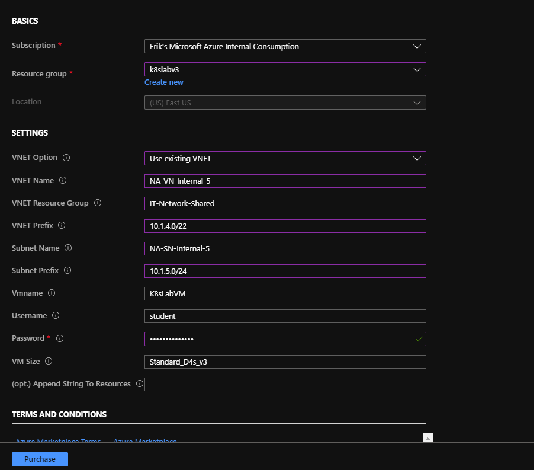
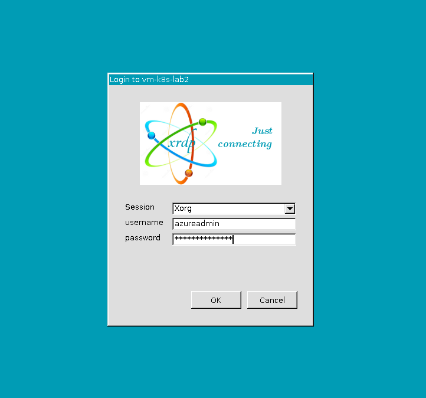
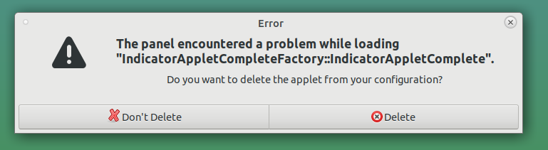
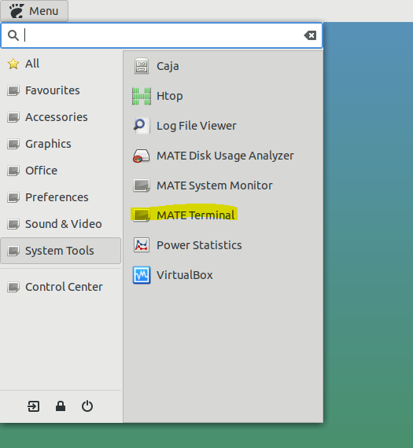
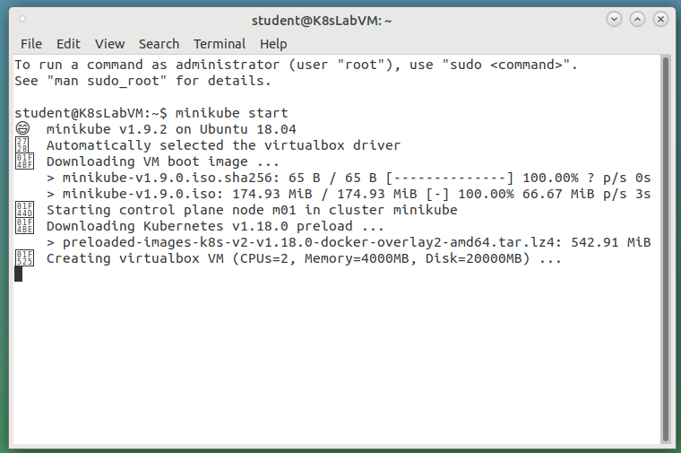
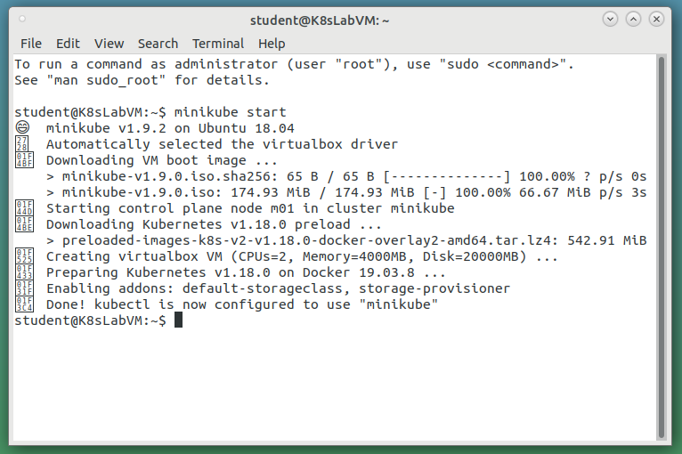
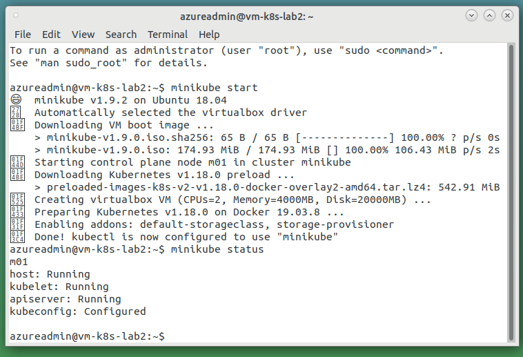
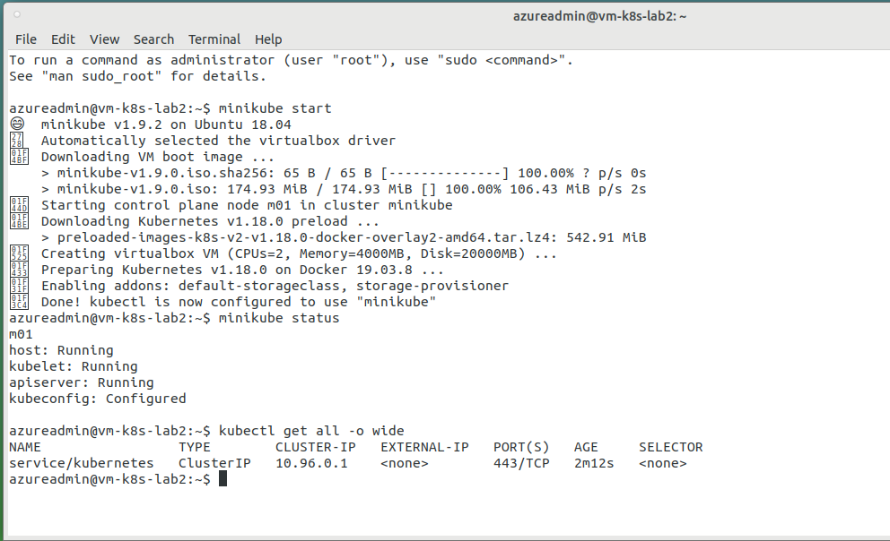

# Azure Ubuntu - minikube Lab Environment 

### Deploy Template to Azure

Click the "Deploy to Azure" button above.  You have 2 options for deployment.  
1. Deploy into a new VNET (Default)
- Fill out the form, Click Purchase.

2. Deploy into an existing VNET
- Fill out the form, Ensure Resource Group name for the VNET (existing) is populated, the VNET name is the name of the existing VNET, the subnet name is the name of the subnet where the VM will reside, Click Purchase.

The deployment will run for a few minutes. It is building the VM and downloading and installing all of the packages to support minikube / graphical desktop / RDP.

---

### Login in to VM via RDP  

Hint - (Bastion is a great solution for this ;) )

- You may see an error message:

- Just click "Delete"

### Start up a terminal

Click Menu in the upper-right corner of the screen, Navigate to "System Tools" and then "MATE Terminal"

### Start minikube

- Run `minikube start`

### Check minikube status

- Run `minikube status`

### Run kubectl and have fun!

- Run `kubectl get all --all-namespaces`

## Note:
- minikube does not start automatically on reboot of the VM.  Upon login, just open a terminal and run  `minikube start`